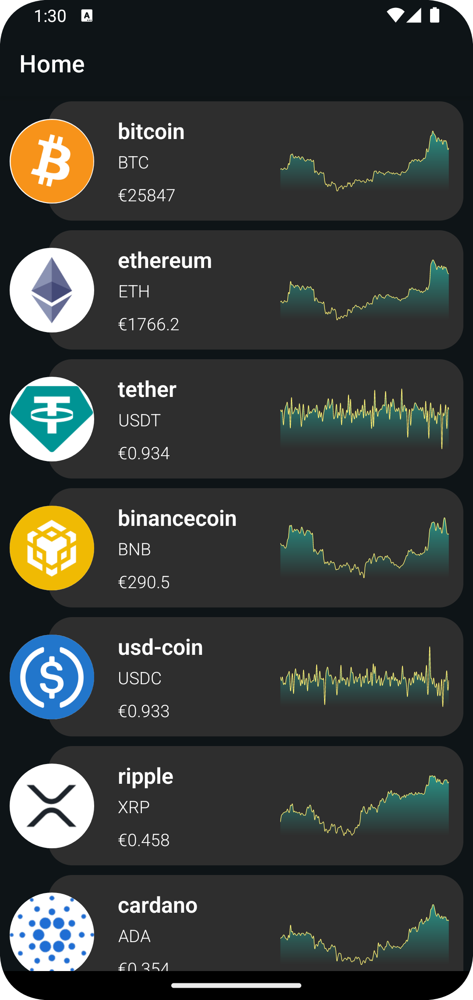
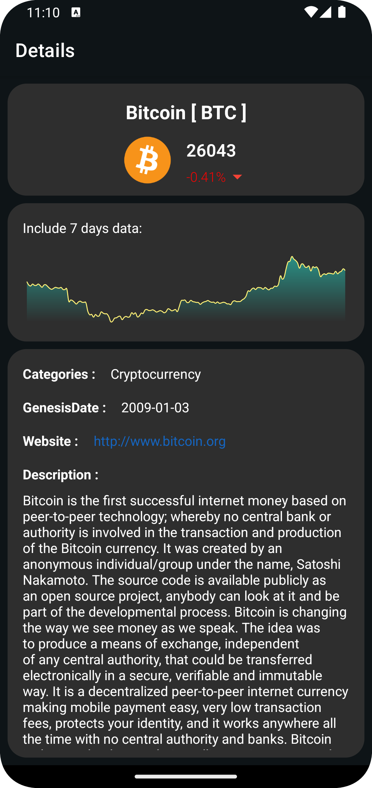

# Concurrency App With Kotlin
Concurrency App using the API from https://www.coingecko.com

The technologies used in this project consist of:

1.Kotlin

2.Xml

3.Hilt

4.Flow 

5.Coroutines

6.Retrofit

7.MVVM

# Screenshot

 
